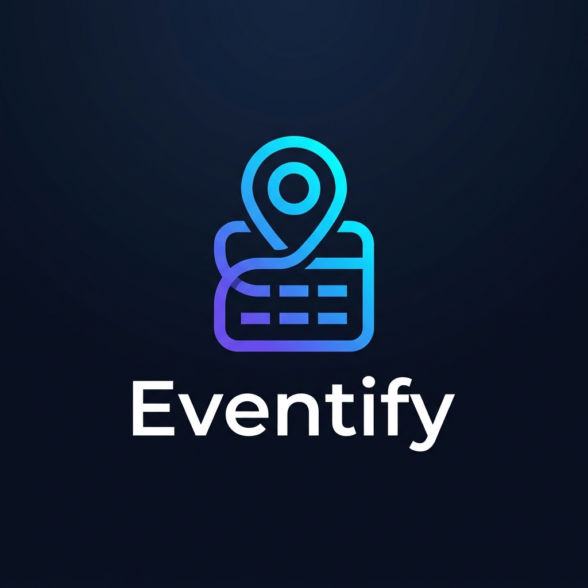

#  Eventify

**Eventify** is a premium, AI-powered event management platform designed for the modern era. Built for the **DYP Hackathon**, it offers a seamless experience for organizers and attendees alike, combining high-end design with powerful functionality.

---

## 🚀 Features

- **AI Assistant:** Integrated smart assistant to help with event scheduling, FAQs, and coordination.
- **Dynamic Dashboard:** Real-time overview of active events, attendee count, and growth metrics.
- **Event Management:** Create, edit, and track events with ease.
- **Premium Analytics:** Professional-grade visualizations and data tracking for event performance.
- **Glassmorphism UI:** Stunning modern aesthetics with dark mode optimization and smooth animations.
- **Firebase Integration:** Secure authentication and real-time database Synchronization.

## 🛠️ Tech Stack

- **Core:** [React 19](https://react.dev/) + [Vite](https://vitejs.dev/)
- **Styling:** [Tailwind CSS 4](https://tailwindcss.com/)
- **Backend:** [Firebase](https://firebase.google.com/) (Auth, Firestore)
- **Animations:** [Framer Motion](https://www.framer.com/motion/)
- **Icons:** [Lucide React](https://lucide.dev/)
- **Charts:** [Recharts](https://recharts.org/)

## 📦 Getting Started

### Prerequisites

- Node.js (v18 or higher)
- npm or yarn

### Installation

1. **Clone the repository:**
   ```bash
   git clone https://github.com/Shivani-mali/Eventify.git
   cd Eventify
   ```

2. **Install dependencies:**
   ```bash
   npm install
   ```

3. **Configure Firebase:**
   Create a `.env` file in the root directory and add your Firebase configuration:
   ```env
   VITE_FIREBASE_API_KEY=your_api_key
   VITE_FIREBASE_AUTH_DOMAIN=your_auth_domain
   VITE_FIREBASE_PROJECT_ID=your_project_id
   VITE_FIREBASE_STORAGE_BUCKET=your_storage_bucket
   VITE_FIREBASE_MESSAGING_SENDER_ID=your_messaging_sender_id
   VITE_FIREBASE_APP_ID=your_app_id
   ```

4. **Run the development server:**
   ```bash
   npm run dev
   ```

## 📈 Roadmap

- [x] Initial design and architecture
- [x] Firebase integration
- [x] UI/UX optimization
- [x] AI Assistant implementation
- [ ] Mobile App (PWA)
- [ ] Ticket booking system

## 🤝 Contributing

Contributions are welcome! Please feel free to submit a Pull Request.

---

Built with ❤️ for the **Salokhenagar Hackathon**.
